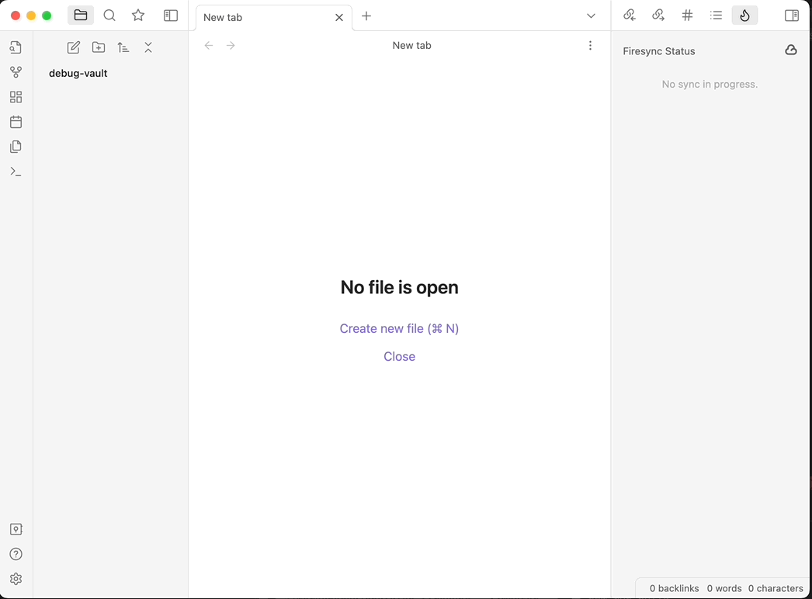
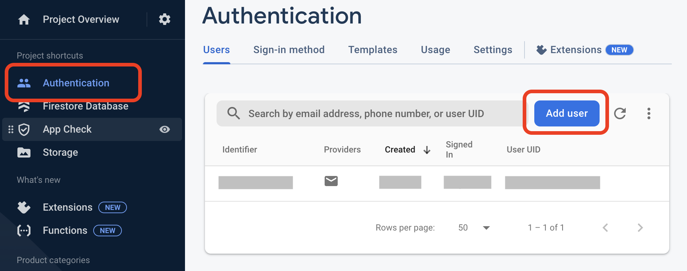
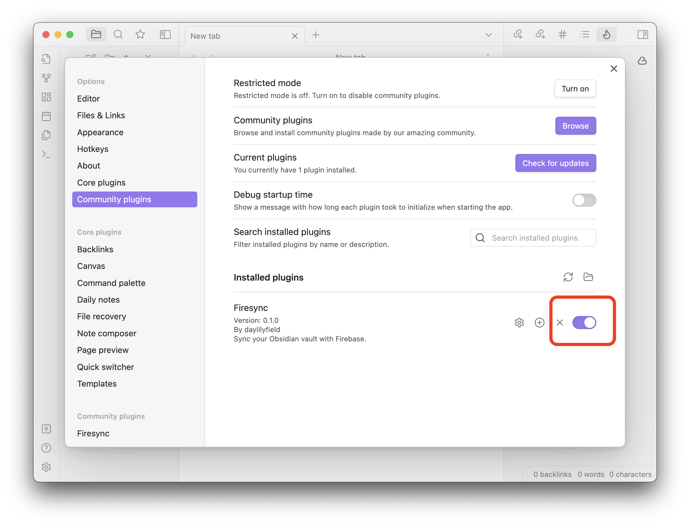
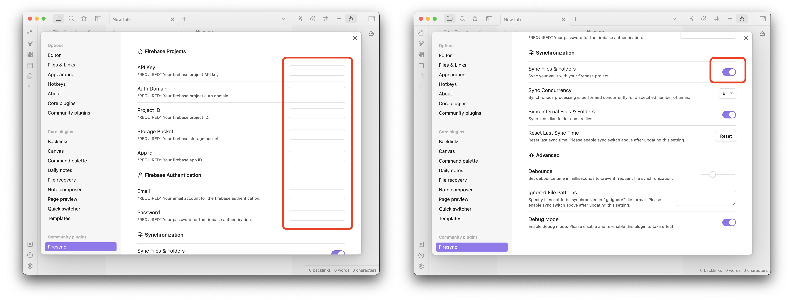

# [WIP] 🔥 Firesync

Synchronize your vaults via Firebase. This is the **UNOFFICIAL** plugin for obsidian in order to synchronize your vaults on various devices via Firebase.



## Notice

- If you would like to get easy access to consistent, reliable and stable synchronization, please check out the [Obsidain official synchronization feature](https://obsidian.md/sync).
- Please be sure to back up your vault, as Firesync may break it at any moment. Currently, Firesync does not provide the ability to restore your original vault.
- Simultaneously using another synchronization solutions can cause data loss, corruption, or duplication.

## Features

- Real-time synchronization across your devices using Firebase.
- All functionalities work with [Firebase's free plan](https://firebase.google.com/pricing).
- Temporary offline use is available.

## How to set up

### Before setting up

To set up Firesync, please prepare the following in advance.

- [gcloud CLI](https://cloud.google.com/sdk/gcloud)
- [Firebase project (Web)](https://console.firebase.google.com/)
- [Node.js & npm](https://nodejs.org/)

### Setup procedure

<details>
<summary>&nbsp;1. Back up your vault.</summary>
<dl><dd><dl><dd>

Backups can be done any way you like; it would be very easy to make a copy of the Vault and store it in a Zip file. I am a cautious person, so I back up to the cloud. I use [`gstuil rsync` command](https://cloud.google.com/storage/docs/gsutil/commands/rsync) by Google Cloud Storage like below.

```sh
gsutil -m rsync -x "\.git" -r ./my-example-vault gs://my-example-vault.appspot.com/backups/my-example-vault
```

</dd></dl></dd></dl>
</details>

<details>
<summary>&nbsp; 2. Create an authenticated user via Firebase Authentication.</summary>
<dl><dd><dl><dd>

Click `Authentication` menu on the left navigation bar, and click `Add user` button to create new authenticated user. Remember this user's email address and password as they will be used when setting up Firesync in Obsidain's preferences.


</dd></dl></dd></dl>
</details>

<details>
  <summary>&nbsp;3. Update CORS settings of Google Cloud Storage.</summary>

<dl><dd><dl><dd>

Obsidian applications cannot access Google Cloud Storage by default due to CORS restrictions. Therefore, the CORS settings for Google Cloud Storage must be changed. This repository contains a simple command to do so, which can be executed as follows. The environment variable `BUCKET` is the name of the Google Cloud Storage bucket you wish to use.

```sh
BUCKET=your-project.appspot.com npm run cors:set
```

The following commands can be used to check if CORS has been set up correctly.

```sh
BUCKET=your-project.appspot.com npm run cors
```

</dd></dl></dd></dl>
</details>

<details>
<summary>&nbsp;4. Deploy rules to Cloud Storage.</summary>
<dl><dd><dl><dd>

To protect your data, we recommend that you set up security rules for Firestore and Cloud Storage. Please execute the following commands.

```sh
npm run deploy:rules
```

</dd></dl></dd></dl>
</details>

<details>
<summary>&nbsp;5. Install this plugin into your Obisidian vault.</summary>
<dl><dd><dl><dd>

Currently, Firesync is not listed on the community plugin list, so please install it manually from the GitHub Release. Download Firesync zip archive, and then extract into `${VAULT}/.obsidian/plugins/obsidian-firesync`. If you do not have that folder, please create it.

</dd></dl></dd></dl>
</details>

<details>
<summary>&nbsp;6. Enable this plugin in Community plugins section of Obsidian's preferences.</summary>
<dl><dd><dl><dd>

In the `Installed plugins` section, please turn on the Firesync switch. You will then see the Firesync section in the lower left side of Obsidian's preferences.



</dd></dl></dd></dl>
</details>

<details>
<summary> 7. Open Firesync section and configure.</summary>
<dl><dd><dl><dd>

Please enter the following options. These configuration items can be obtained from the [Firebase Console](https://console.firebase.google.com/).

- API Key
- Auth Domain
- Project ID
- Storage Bucket
- App ID

Then enter the email address and password of the previously created authenticated user.

- Email
- Password

After entering all the above items, please turn on the `Sync Files & Folders` switch.



</dd></dl></dd></dl>
</details>

If you would like to setup another device, please setup with **same vault name** in order to enable bidirectional synchronization.

## Options

- TBD.

## Commands

**Firesync: Show synchronization status**

Open the status view to show progresses of synchronization with Firebase. If you have errors during synchronization, you can retry or discard in this view.

## QA

<dl>
<dt>Q. Firesync has prevented Obsidian from starting. What should I do?<dt>
<dd>

Make sure Obsidian is quited and open the file .obisidan/obisidian-firesync/data.json in an editor. Change `sync: true` to `sync:false` and save the file. Start Obsidian again.

</dd>
</dl>

## Howt to develop

TBD.
